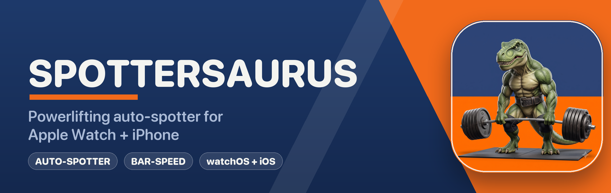

<p align="center">
  
</p>

# Spottersaurus

> Powerlifting **auto-spotter** for Apple Watch + iPhone.

The Apple Watch watches the bar via wrist motion + heart rate during a working set.
On a detected stall, grind, or pin it fires an **escalating self-alert** — a soft
"grinding" nudge, then a loud **RACK IT** — so a solo lifter knows to bail the rep.
The iPhone plans programs and reviews history; the Watch is the in-gym executor.

## Features

- 🦖 **Auto-spotter** — conservative, two-stage stall detection (grind → RACK IT)
- 🏋️ **All three SBD** — bench/deadlift via wrist velocity; squat via tempo + HR + manual grind tap
- ⌚ **Watch-first** — standalone `HKWorkoutSession` with high-rate CoreMotion + HR; **the Watch owns the live session**
- 📊 **Bar-speed (VBT)** — concentric velocity readouts and velocity-at-load charts
- 📱 **iPhone planner** — custom program builder + 5/3/1 and linear-progression presets
- ☁️ **Synced** — SwiftData + CloudKit private mirror; writes finished workouts to Apple Health

Full feature map → [`docs/features.md`](docs/features.md).

## Platforms

iOS 26 / watchOS 26. SwiftUI · SwiftData · WorkoutKit · HealthKit · CoreMotion ·
WatchConnectivity · Swift Charts.

## Project layout

| Target | Role |
|---|---|
| `Spottersaurus` | iOS app — planner / reviewer + live Mirror |
| `Spottersaurus Watch App` | watchOS app — authoritative live executor + auto-spotter |
| `SpottersaurusKit` | shared package — Model · Detection · Session · Sync · Analytics · Design |

The shared package holds everything written once (schema, detection math, session
logic, transport domain, design tokens) and unit-tests on macOS. Architecture,
module graph, and data-flow diagrams → [`docs/architecture.md`](docs/architecture.md).

## Documentation

| Doc | What |
|---|---|
| [`docs/architecture.md`](docs/architecture.md) | System, module graph, hexagonal transport, live-session data flow (mermaid). |
| [`docs/features.md`](docs/features.md) | Feature map + the auto-spotter detection pipeline. |
| [`docs/PLAN.md`](docs/PLAN.md) | Roadmap: locked decisions, current state, phased plan. |
| [`docs/backlog.md`](docs/backlog.md) | Sized (S/M/L/XL), agent-deliverable task breakdown. |
| [`docs/adr/`](docs/adr/) | Architectural Decision Records. |
| [`CONTEXT.md`](CONTEXT.md) | Ubiquitous-language glossary. |
| [`docs/TASKS.md`](docs/TASKS.md) | Execution checklist for the plan. |

## Status

🚧 Active development. Solo auto-spotter core, shared model/detection/analytics,
Watch live-set UI, and iPhone planner/history/charts are in. Current focus:
stabilize the alert path, then restructure the Watch↔iPhone transport into a
shared, testable Kit service. See [`docs/PLAN.md`](docs/PLAN.md).

## Build

```bash
# shared package — the reliable test gate (runs on macOS)
cd Packages/SpottersaurusKit && swift test

# iOS app
xcodebuild build -scheme Spottersaurus -destination 'platform=iOS Simulator,name=iPhone 17'
```

---

<sub>Mascot art and brand: navy + safety-orange, the Spottersaurus powerlifting T-rex.</sub>
