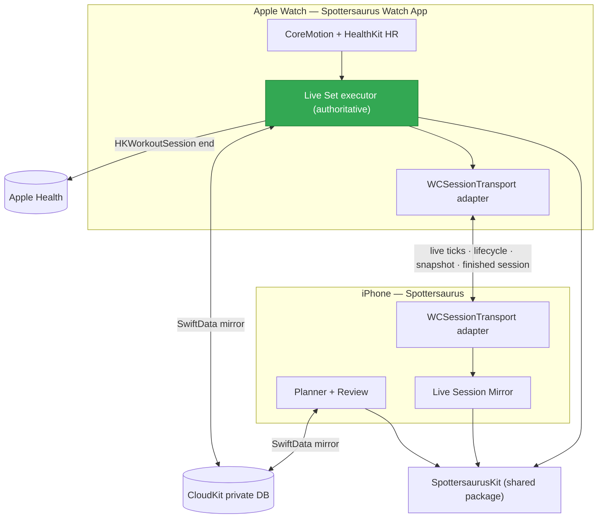
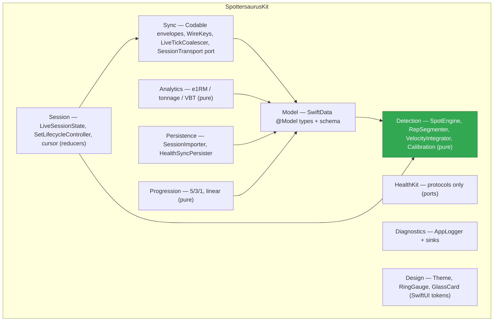
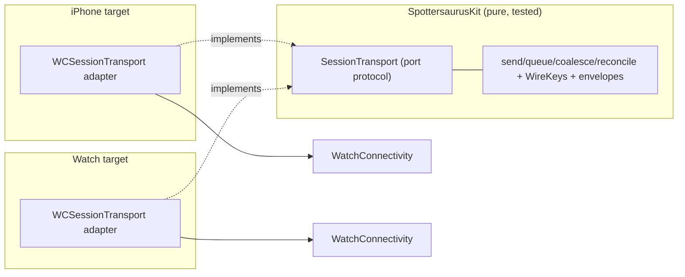
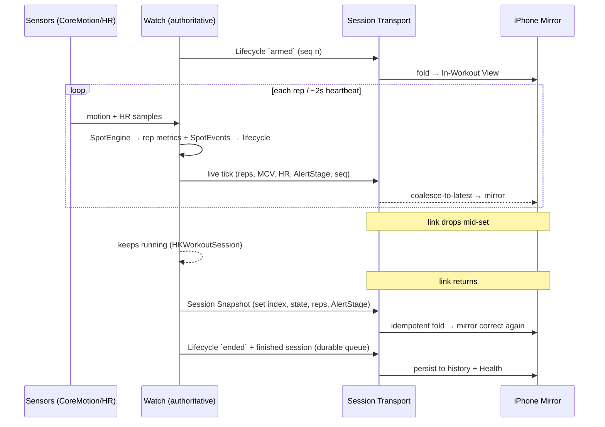

# Architecture

How Spottersaurus is put together, from the whole system down to the module
graph. Vocabulary is in [`../CONTEXT.md`](../CONTEXT.md); the decisions behind
this shape are in [`adr/`](adr/); the work sequence is in [`PLAN.md`](PLAN.md).

---

## 1. System (high level)

Three targets. The **Watch is the authoritative live executor** (sensors, runs
standalone); the **iPhone plans and mirrors**. Live in-set data crosses via
**WatchConnectivity**; durable data (programs, history, maxes, calibration) syncs
via **CloudKit private mirror**; finished workouts are written to **Apple Health**.

The Watch↔iPhone link is `WCSession`; there is **no push/APNs server** (see
[ADR 0001](adr/0001-live-session-surfaces-and-transport.md)). The iPhone can wake
the Watch straight into an armed workout via
`HKHealthStore.startWatchApp(with:)` ([ADR 0003](adr/0003-connection-keepalive-and-liveness.md)).

---

## 2. Shared package `SpottersaurusKit` (low level)

Everything written once lives here — schema, detection math, session logic,
transport domain, design tokens — so both apps consume one source of truth. The
package builds and unit-tests on **macOS** (`swift test`), so it holds **no
device-only frameworks** (HealthKit / CoreMotion / WatchConnectivity live in the
app targets, behind ports).

Dependencies are acyclic and point inward at the pure `Detection` core. `Model →
Detection` is the only cross-layer edge, and it points at the most stable module
(healthy per the Stable Dependencies Principle).

| Layer | Responsibility |
|---|---|
| `Detection` | Sample buffers in, `SpotEvent`/`RepResult` out. Pure, hardware-free, exhaustively unit-tested. |
| `Model` | The one SwiftData schema both apps share; CloudKit-mirrored. |
| `Session` | Deterministic reducers that sequence a set (arm → reps → rack → rest) and fold the iPhone Mirror. Time injected. |
| `Sync` | Wire format: envelopes + `WireKeys` + coalescer + the `SessionTransport` port. |
| `Analytics` / `Progression` | Pure functional cores over `Model`. |
| `Persistence` | Maps envelopes ↔ SwiftData; writes to Health. |
| `Design` | Shared visual tokens; self-contained. |

---

## 3. Session Transport (hexagonal)

The transport is a **port in Kit, adapter in each app** (see
[ADR 0002](adr/0002-watch-authoritative-live-session-hexagonal-transport.md)).
All send / queue / coalesce / reconcile logic and the wire keys are pure and
macOS-testable; only the `WCSession` wiring is per-target. This removes the
duplicated wire keys and the untestable transport code the
[architecture audit](#audit) flagged.

---

## 4. Live Session data flow

The Watch owns the state; the iPhone folds a **Mirror** from a stream of
sequence-numbered events. A dropout self-heals because the Watch pushes one full
**Session Snapshot** whenever the link returns; the finished session always
travels the durable queue ([ADR 0004](adr/0004-offline-reconcile-and-calibration-persistence.md)).

---

## Architecture audit

The module structure was audited (Brooks-Lint) at **89/100**, no criticals:
clean layering, acyclic dependencies, pure detection core, strong DI seams.
Open follow-ups — shared `WireKeys`, `SessionTransport` extraction, splitting the
Watch `LiveSetViewModel` — are scheduled in Phase 2 of [`PLAN.md`](PLAN.md).
