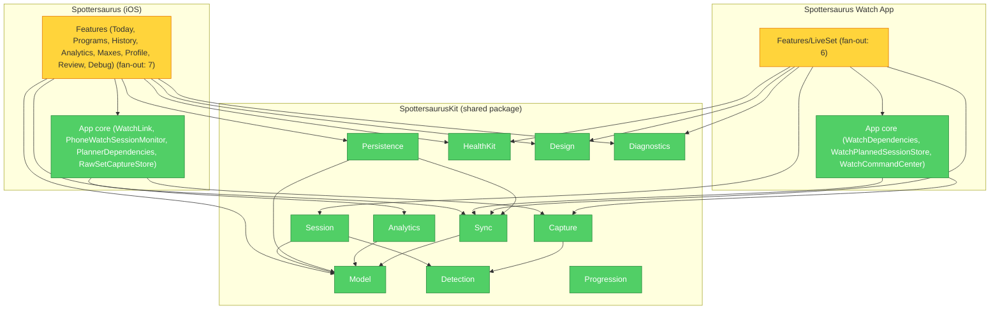

# Architecture Audit — 2026-08-05

Run via `brooks-lint:brooks-audit`. Full findings below; remediation tracked as
tickets in [`backlog.md`](../backlog.md) (Phase 5 — Architecture Audit
Remediation).

**Health Score:** 87/100 (trend: 84 → 87, +3 over last 3 runs — history in
`.brooks-lint-history.json`)
**Scope:** entire project (~130 Swift files — `Spottersaurus` iOS app,
`Spottersaurus Watch App`, `SpottersaurusKit` shared package)

Solid layering overall — pure detection/domain core, single-sourced math,
consistent MVVM hybrid pattern across ViewModels — but the View layer on
Watch absorbed orchestration duties, and Debug tooling ships unguarded into
production screens.

---

## Module Dependency Graph

---

## Findings

### 🟡 Warning

**Change Propagation — `LiveSetView` doubles as session orchestrator, not just presentation**
Symptom: `Spottersaurus Watch App/Features/LiveSet/LiveSetView.swift` owns `startWarmup()`, `startWorkout()`, `sendFinishedSessionIfAvailable()`, `handleLatestCommand()`, `playAlertFeedbackIfNeeded()` — private methods sequencing `viewModel` (domain/display), `sessionCoordinator` (hardware bridge), `dependencies` (wire transport) directly. Holds `WatchLiveSessionCoordinator()` + `WatchLiveSetFeedback()` as its own `@State`, alongside `LiveSetViewModel`.
Source: Fowler — Refactoring, Divergent Change (type changes for UI-layout reasons, sensor-coordination reasons, wire-protocol-sequencing reasons); Martin — Clean Architecture, SRP.
Consequence: View untestable for "command arrives mid-set" or "finish-capture fires exactly once" without SwiftUI — only exercised via device runs/previews now. LiveSet feature growth lands unrelated changes in one file, defeating the VM/coordinator split's purpose.
Remedy: Move `startWarmup`, `startWorkout`, `sendFinishedSessionIfAvailable`, `handleLatestCommand`, `playAlertFeedbackIfNeeded` onto `LiveSetViewModel` (or dedicated `LiveSetOrchestrator` it owns), injecting `sessionCoordinator`/`dependencies`/`feedback`. Leave View holding only `viewModel` + layout.

**Knowledge Duplication / Accidental Complexity — Debug tooling ships unguarded into production, duplicated across two screens**
Symptom: `LogViewerView()` linked from both `MaxesView.swift:18` and `ProfileView.swift:85` (same "Debug Logs" entry, two call sites); `RawCaptureBrowserView()` linked from `ProfileView.swift:90`. Zero `#if DEBUG` conditionals found across `Features/Debug/*.swift` or either call site.
Source: Hunt & Thomas — Pragmatic Programmer, DRY; McConnell — Code Complete, construction-phase discipline.
Consequence: Release/App Store build currently exposes raw IMU/HR sensor-capture browser + log viewer to every end user via Profile tab. Duplicate entry in `MaxesView` means a future removal is easy to miss one site — `ProfileView`'s own header comment already says the entry "moved here."
Remedy: Gate `debugSection` (`ProfileView.swift`) and `MaxesView`'s toolbar item behind `#if DEBUG` (or a build-config flag if TestFlight should keep it); delete the duplicate `MaxesView` entry now that `ProfileView` is canonical.

### 🟢 Suggestion

**Dependency Disorder (seam) — `WatchLink.shared` bypassed at two of four call sites**
Symptom: `send(plannedSession:)`/`send(command:)` only called through `PlannerDependencies.live` closures — but `WatchLink.shared.reactivate()` (`TodayView.swift:27`) and `WatchLink.shared.configure(...)` (`PlannerTabsView.swift:29`) call the singleton directly, skipping the established abstraction.
Source: Feathers — Working Effectively with Legacy Code, Ch. 4 (Seam Model).
Consequence: Minor — `TodayView`'s reconnect path can't be exercised with a fake transport like every other WatchLink interaction; next engineer adding a call has two competing examples to copy.
Remedy: Add `reactivate` to `PlannerDependencies`, or comment the two direct-call sites explaining the exemption (composition-root wiring vs. per-send mutation) — mirroring the doc comment `WatchDependencies.swift` already has for its analogous singleton reads.

**Accidental Complexity — `ProgramDayBuilderViewModel` is a stateless helper wearing a ViewModel's name**
Symptom: `ProgramDayBuilderViewModel.swift` is a `struct`, no stored state, three free functions taking `inout ProgramDayDraft` — unlike sibling `ProgramBuilderViewModel` (`@Observable final class` owning `draft`) and every other VM in the codebase (`HistoryViewModel`, `AnalyticsViewModel`, etc.) which follow the same `@Observable` + `update(with:)` shape.
Source: Fowler — Refactoring, Middle Man; Ousterhout — Philosophy of Software Design, Ch. 4 (name promises more than the type delivers).
Consequence: Nothing breaks — but misdirects a reader scanning `Builder/` for where day-editing state lives.
Remedy: Fold `addSet`/`deleteSets`/`moveSets` into `ProgramDayDraft` as mutating methods, or rename the type away from the ViewModel pattern (e.g. `ProgramDayEditing`).

**Cognitive Overload — `LiveSetViewModel` blends three responsibilities behind one interface**
Symptom: 463-line class mixes UI display formatting (`statusText`, `tone`, `calibrationDetailText`), domain lifecycle orchestration (`arm`, `rack`, `ingestMotionSamples`), and raw-capture-marker instrumentation (`onCaptureMarker`, `emitCaptureMarker`) in one type. (Note: `P2-10` already extracted the sensor-buffer/telemetry bookkeeping into `LiveSetSensorAggregator` — this finding covers what's left.)
Source: Ousterhout — Philosophy of Software Design, Ch. 4 (deep vs. shallow modules).
Consequence: Low today — file is unusually well-commented — but it's already the largest non-generated Watch-target file and a magnet for further unrelated growth.
Remedy: Extract capture-marker instrumentation (`onCaptureMarker`/`emitCaptureMarker`/the marker half of `stepLifecycle`) into a small `LiveSetCaptureMarkerEmitter` the VM delegates to.

---

## Testability Seam Assessment

Generally healthy: `HealthKitAuthorizing` injected into `WatchLiveSessionCoordinator`/`LiveSetViewModel`; `SpottersaurusSchema`'s container factory takes `inMemory` for tests; `PlannerDependencies`/`WatchDependencies` wrap nearly all cross-device transport behind closures. One gap: `WatchLink.reactivate()`/`configure()` direct-singleton calls (Suggestion above).

## Conway's Law Check

Skipped — single-author commit history, no team-structure axis to check.

---

## Summary

Codebase well-layered for its size: `Detection` dependency-free and pure, Epley 1RM math single-sourced across Model/Sync/Analytics, every ViewModel follows the same documented hybrid pattern. Highest-leverage fix: gate the two Debug entry points behind `#if DEBUG` before any TestFlight/App Store build — five-minute change, real user-facing consequence. `LiveSetView` orchestration split is the more structural item worth doing before LiveSet grows further.
