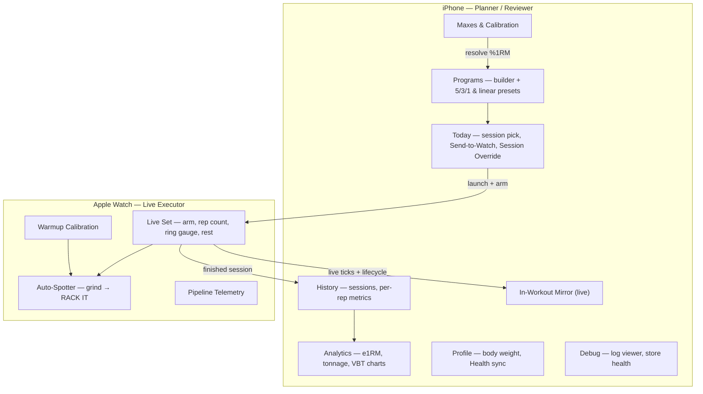
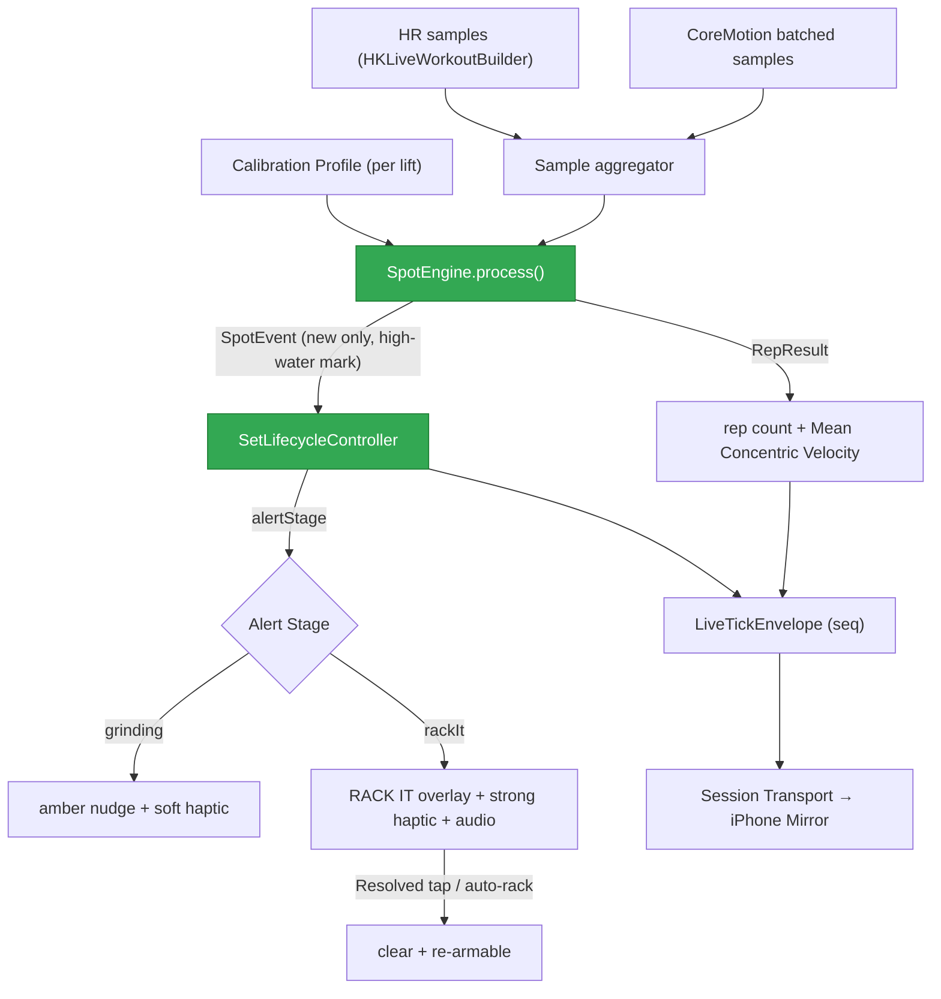

# Features

The user-facing capabilities of Spottersaurus, mapped to where they live in the
tree. Architecture is in [`architecture.md`](architecture.md); status and what's
next per feature is in [`PLAN.md`](PLAN.md).

---

## Feature map (high level)

---

## iPhone features

| Feature | Path | Does |
|---|---|---|
| Today / Start | `Spottersaurus/Features/Today` | Picks the day's Planned Session, applies a Session Override, sends to (and launches) the Watch. |
| Program builder | `Spottersaurus/Features/Programs` | Build Programs → days → Planned Sets; 5/3/1 and linear presets. |
| Maxes & Calibration | `Spottersaurus/Features/Maxes` | Edit Training Maxes; view/reset Calibration Profiles *(Phase 3)*. |
| History | `Spottersaurus/Features/History` | Session list → set detail with per-rep metrics and spotter events. |
| Analytics | `Spottersaurus/Features/Analytics` | e1RM trend, tonnage, velocity-at-load, spotter-event frequency (Swift Charts). |
| Profile | `Spottersaurus/Features/Profile` | Body weight, Health sync. |
| Review | `Spottersaurus/Features/Review` | Post-session review surface. |
| Live Session Mirror | `Spottersaurus/App` + `Spottersaurus/Features/LiveSession` | Folds the Watch stream into the In-Workout View. |
| Debug | `Spottersaurus/Features/Debug` | Log viewer + store-health banner. |

## Watch features

| Feature | Path | Does |
|---|---|---|
| Live Set | `Spottersaurus Watch App/Features/LiveSet` | Arms a set, counts reps, drives the ring gauge, runs the rest timer. |
| Auto-Spotter | `SpotEngine` (Kit) + `RackItOverlayView` | Two-stage escalation: `grinding` amber nudge → full-screen red `RACK IT`. |
| Warmup Calibration | `LiveSetCalibrationState` + `Calibration` (Kit) | Captures a per-lift baseline from warmup reps *(persisted in Phase 3)*. |
| Pipeline Telemetry | `PipelineTelemetryView` | Proves the sensor pipeline is alive (samples/sec, HR flowing). |
| Sensors | `WatchMotionStreamAdapter`, `WatchWorkoutSessionAdapter` | High-rate CoreMotion + `HKLiveWorkoutBuilder` HR under an `HKWorkoutSession`. |

---

## The auto-spotter pipeline (low level)

The core feature. Sensor samples flow through the pure `Detection` engine into
the `SetLifecycleController`, which drives both the on-Watch alert and the tick
stream to the iPhone. Everything except the sensor adapters and the SwiftUI views
is pure and unit-tested in Kit.

> The **new-events-only** feed into the lifecycle and **clear + re-armable**
> resolve are the Phase 1 fix for the stuck-`RACK IT` defect — see
> [`PLAN.md`](PLAN.md) Phase 1 and
> [ADR 0004](adr/0004-offline-reconcile-and-calibration-persistence.md).

### Detection paths per lift

| Lift | Wrist | Alert trigger | Stall signal |
|---|---|---|---|
| Bench, Deadlift | tracks the bar (arm extends) | Velocity (VBT) | Mid-concentric velocity collapses toward ~0 before lockout, or concentric duration exceeds the calibrated band. |
| Squat | rides the bar (hands locked on back) | Tempo + HR *(velocity computed, not yet triggered)* | Concentric tempo blows out past baseline, corroborated by HR. Wrist vertical velocity ≈ bar velocity via fused-gravity projection, so MCV is computed/captured, but the trigger stays tempo/HR until validated — see [ADR 0009](adr/0009-squat-velocity-via-fused-gravity.md). No manual tap (hands locked, [ADR 0005](adr/0005-no-mid-rep-manual-input.md)). |
